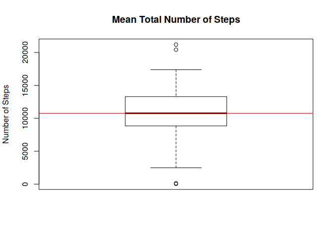
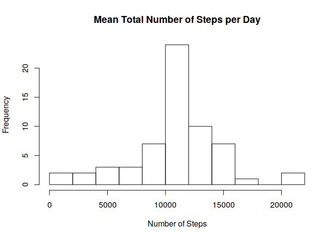

## Loading and preprocessing the data

```r
data = read.csv("activity.csv")
head(data)
```

```
##   steps       date interval
## 1    NA 2012-10-01        0
## 2    NA 2012-10-01        5
## 3    NA 2012-10-01       10
## 4    NA 2012-10-01       15
## 5    NA 2012-10-01       20
## 6    NA 2012-10-01       25
```

## What is mean total number of steps taken per day?

```r
library(dplyr)
```


```r
total_steps <- function(dataset) {
        aggregate(steps ~ date, dataset, sum)
}

plot_histogram <- function(dataset) {
        actual_data <- dataset %>%
                       select(steps, date, interval) %>%
                       filter(!is.na(steps))
        dt_agg <- total_steps(actual_data)
        with(dt_agg,  hist(steps, 
                           breaks = 10, 
                           xlab = "Number of Steps", 
                           main = "Total Number of Steps per Day"))
        actual_data
}
actual_data <- plot_histogram(data)
```

<!-- -->

#### Median and Mean Values  

```r
plot_mean_and_median <- function(dataset) {
        with(dataset, {
                boxplot(steps)
                abline(h = mean(steps), lwd = 1, col = "red")
        })
}
plot_mean_and_median(total_steps(actual_data))
```

<!-- -->


```r
cat(paste(summary(total_steps(actual_data))[, 2][4],
      summary(total_steps(actual_data))[, 2][3],
      sep = "\n"))
```

```
## Mean   :10766  
## Median :10765
```
## What is the average daily activity pattern?

```r
dt_avg <- aggregate(steps ~ interval, data = actual_data, mean)
with(dt_avg, plot(y = steps, 
                  x = interval, 
                  type = "l", 
                  ylab = "Average Number of Steps per Day",
                  xlab = "5-minute Interval Through the Day")
)
```

<!-- -->


```r
max_avg_steps <- dt_avg %>%
                 select(steps, interval) %>%
                 filter(steps == max(steps))
```
The 5-minute interval that contains the maximum average of steps, across all days, is 835, with 206.2 steps.

## Imputing missing values

```r
missing_values <- sum(is.na(data$steps))
```
The number of rows with missing values is 2304.

The missing values will be replaced by the average value of a given 5-minute interval.

```r
data[is.na(data$steps), "steps"] <- sapply(data[is.na(data$steps), "interval"],
        function(interval) {dt_avg[dt_avg["interval"] == interval, "steps"]})
head(data)
```

```
##       steps       date interval
## 1 1.7169811 2012-10-01        0
## 2 0.3396226 2012-10-01        5
## 3 0.1320755 2012-10-01       10
## 4 0.1509434 2012-10-01       15
## 5 0.0754717 2012-10-01       20
## 6 2.0943396 2012-10-01       25
```
The new histogram for the total number of steps is

```r
new_data <- plot_histogram(data)
```

<!-- -->

With new median and mean valus

```r
plot_mean_and_median(total_steps(new_data))
```

<!-- -->

```r
cat(paste(summary(total_steps(new_data))[, 2][4],
      summary(total_steps(new_data))[, 2][3],
      sep = "\n"))
```

```
## Mean   :10766  
## Median :10766
```

## Are there differences in activity patterns between weekdays and weekends?
